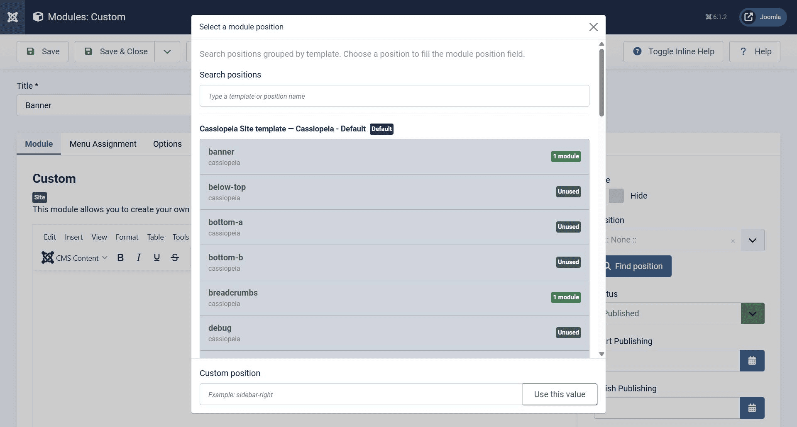
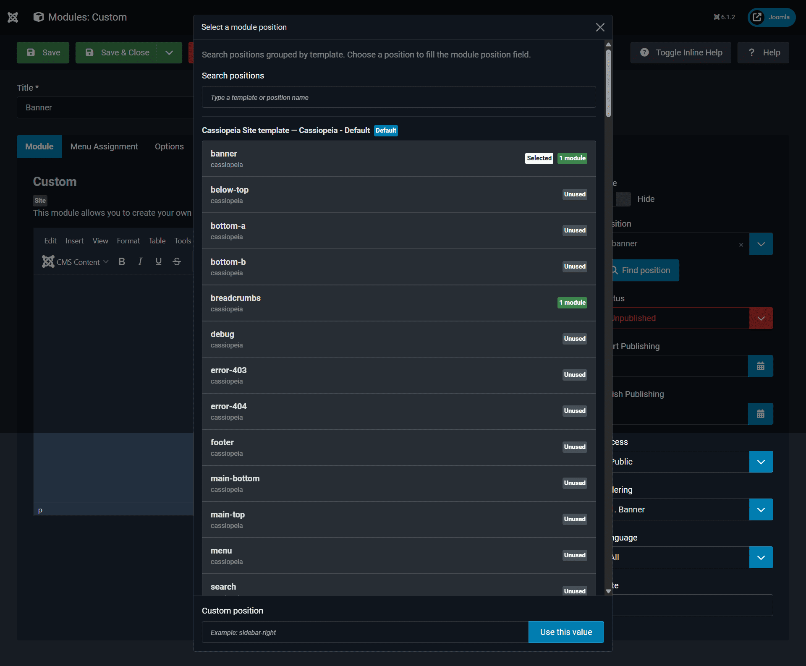

# JT Position Finder

<p align="center">
  <strong>Accessible Visual Module Position Finder for Joomla Administrator</strong>
</p>

<p align="center">
  Find, search, preview and select Joomla module positions directly from the module edit screen.
</p>

<p align="center">
  <strong>Joomla 6.1+</strong> • <strong>PHP 8.3+</strong> • <strong>Atum Compatible</strong> • <strong>No Core Hacks</strong>
</p>

<p align="center">
  <a href="https://github.com/joomtheme/JT-Position-Finder/releases">
    
  </a>
  <a href="https://github.com/joomtheme/JT-Position-Finder/blob/main/LICENSE.txt">
    
  </a>
  
  
</p>

---

## Overview

**JT Position Finder** is a lightweight Joomla administrator plugin that improves the module position selection workflow.

When editing a Joomla module, finding the correct template position can be time-consuming, especially on websites with multiple templates, many module positions or complex layouts.

JT Position Finder adds a visual **Find position** helper directly below the native Joomla module position field. Administrators can search, preview and select available template module positions from an accessible modal interface.

The plugin keeps Joomla’s original module position field intact. It does not replace Joomla core behavior, does not modify administrator template files and does not change Bootstrap or template assets.

---

## Demo

View demo screenshots here:

[Demo Screenshots](https://github.com/joomtheme/JT-Position-Finder/tree/main/docs/demo)

### Light Mode




### Dark Mode




---

## Key Features

- Visual module position finder for Joomla Administrator
- Adds a **Find position** button to the module edit screen
- Search module positions by template or position name
- Lists available positions grouped by template
- Shows used and unused position indicators
- Supports custom position values
- Works directly inside the native Joomla module edit screen
- Compatible with Joomla Administrator light mode
- Compatible with Joomla Administrator dark mode
- Designed for the Atum administrator template
- Keyboard-friendly modal behavior
- ESC key support
- Focus-friendly interface
- Screen-reader friendly modal structure
- Multilingual ready
- English and Turkish language files included
- Joomla Web Asset Manager based
- No Joomla core modifications
- No Atum administrator template modifications
- No Bootstrap core modifications
- No frontend template modifications
- No external CSS framework
- No CDN dependency

---

## Why JT Position Finder?

Joomla module positions are powerful, but selecting the correct position can be difficult when working with multiple templates or complex layouts.

Normally, administrators may need to remember position names, check template documentation or inspect template files.

JT Position Finder solves this by making module positions visible, searchable and selectable directly inside the administrator module edit screen.

It focuses on one clear purpose:

> Make Joomla module position selection easier, faster and more accessible while preserving Joomla’s native architecture.

---

## Installation

1. Download the latest installable package from GitHub Releases:

   ```text
   plg_system_jtpositionfinder_v1.0.3.zip
   ```

2. Open Joomla Administrator.

3. Go to:

   ```text
   System → Install Extensions
   ```

4. Upload and install the package.

5. Go to:

   ```text
   System → Plugins
   ```

6. Search for:

   ```text
   System - JT Position Finder
   ```

7. Enable the plugin.

8. Open:

   ```text
   Content → Site Modules
   ```

9. Create or edit a module.

10. Use the **Find position** button below the Position field.

---

## How It Works

1. JT Position Finder loads only in the Joomla Administrator module edit screen.
2. It detects the native Joomla module position field.
3. It adds a **Find position** helper button below the field.
4. When clicked, an accessible modal opens.
5. Available template positions are displayed and searchable.
6. The selected position is inserted into the original Joomla module position field.

The original Joomla field remains available and unchanged.

---

## Compatibility

| Requirement | Status |
| --- | --- |
| Joomla 6.1+ | Supported |
| PHP 8.3+ | Supported |
| Joomla Administrator | Supported |
| Atum Administrator Template | Supported |
| Light Mode | Supported |
| Dark Mode | Supported |
| Web Asset Manager | Used |
| System Plugin | Yes |
| Joomla Core Hacks | No |
| Bootstrap Core Changes | No |
| External CDN | No |

---

## Accessibility

Accessibility is an important part of JT Position Finder.

The modal interface is designed to support a better administrator workflow with:

- Keyboard navigation
- ESC close behavior
- Focus handling
- Clear button labels
- Screen-reader friendly modal structure
- Searchable position list
- Readable usage indicators

This makes the extension useful for developers, site builders, agencies, administrators and users who manage complex Joomla module layouts.

---

## Light and Dark Mode

JT Position Finder works naturally with Joomla Administrator light and dark modes.

The plugin does not add a custom CSS framework and does not override Atum or Bootstrap core styling.

It uses Joomla administrator interface conventions and Bootstrap-compatible markup to keep the experience familiar and consistent.

---

## No Core Modifications

JT Position Finder does **not** modify:

- Joomla core files
- Joomla administrator template files
- Atum files
- Bootstrap files
- Frontend template files
- Module files

The plugin works through Joomla’s extension system and Joomla Web Asset Manager.

---

## Recommended Use Cases

JT Position Finder is useful for:

- Joomla site builders
- Template developers
- Web agencies
- Joomla administrators
- Multilingual websites
- Complex module layouts
- Sites using many module positions
- Users who want a faster module editing workflow
- Users who prefer a visual and searchable position selector

---

## Repository Structure

```text
JT-Position-Finder/
├── plg_system_jtpositionfinder.xml
├── README.md
├── CHANGELOG.md
├── CONTRIBUTING.md
├── SECURITY.md
├── LICENSE.txt
├── services/
│   └── provider.php
├── src/
│   └── Extension/
│       └── Jtpositionfinder.php
├── language/
│   ├── en-GB/
│   │   ├── plg_system_jtpositionfinder.ini
│   │   └── plg_system_jtpositionfinder.sys.ini
│   └── tr-TR/
│       ├── plg_system_jtpositionfinder.ini
│       └── plg_system_jtpositionfinder.sys.ini
├── media/
│   ├── joomla.asset.json
│   └── js/
│       └── jt-position-finder.js
├── updates/
│   ├── update.xml
│   └── changelog.xml
└── docs/
    └── demo/
        ├── README.md
        └── images/
            ├── jt_admin_module_find_button.png
            ├── jt_admin_module_find_button_dark.png
            ├── jt_admin_module_modal.png
            └── jt_admin_module_modal_dark.png
```

---

## Release Packages

Installable ZIP packages are published under GitHub Releases.

The repository contains the source files, update server metadata and documentation.

Download the latest installable package from:

[GitHub Releases](https://github.com/joomtheme/JT-Position-Finder/releases)

Package name:

```text
plg_system_jtpositionfinder_v1.0.3.zip
```

---

## Joomla Update Server

JT Position Finder includes Joomla update server metadata.

Update files are stored in:

```text
updates/update.xml
updates/changelog.xml
```

These files are used by the Joomla Update System to detect and install extension updates.

---

## Language Support

Included language files:

```text
English: en-GB
Turkish: tr-TR
```

Language files are stored in:

```text
language/en-GB/
language/tr-TR/
```

---

## Security

JT Position Finder is an administrator plugin and follows a minimal, core-safe approach.

The extension does not:

- Modify Joomla core files
- Modify administrator template files
- Modify Bootstrap files
- Load external JavaScript from a CDN
- Use encrypted or obfuscated code
- Store sensitive user data
- Expose unnecessary public endpoints

Please report security issues privately. See:

[SECURITY.md](SECURITY.md)

---

## Contributing

Contributions are welcome.

Before submitting changes, please make sure they follow the project goals:

- Keep the extension lightweight
- Preserve Joomla core compatibility
- Keep the interface accessible
- Avoid unnecessary dependencies
- Do not modify Joomla core, Atum, Bootstrap or template files
- Keep language strings in language files
- Use Joomla APIs and Web Asset Manager where possible

See:

[CONTRIBUTING.md](CONTRIBUTING.md)

---

## Changelog

See:

[CHANGELOG.md](CHANGELOG.md)

---

## Maintainer

**JoomTheme**

- JoomThenme: [https://www.joomtheme.com](https://www.joomtheme.com)
- GitHub: [JoomTheme](https://github.com/joomtheme)

---

## Project Links

- Repository: [JT Position Finder](https://github.com/joomtheme/JT-Position-Finder)
- Demo Screenshots: [docs/demo](https://github.com/joomtheme/JT-Position-Finder/tree/main/docs/demo)
- Releases: [GitHub Releases](https://github.com/joomtheme/JT-Position-Finder/releases)
- JoomlaTR: [https://www.joomtheme.com](https://www.joomtheme.com)

---

## License

JT Position Finder is licensed under the **GNU General Public License v2 or later**.

See:

[LICENSE.txt](LICENSE.txt)

---

<p align="center">
  <strong>JT Position Finder</strong><br>
  Accessible module position selection for Joomla Administrator.
</p>
